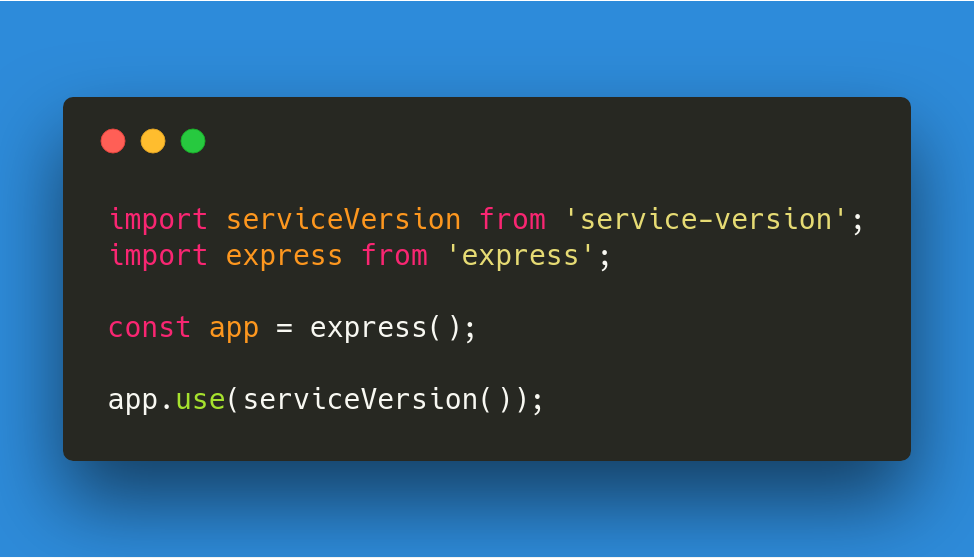

# Service-version

# [](https://github.com/wasc-io/service-version)

## Overview

[service-version](https://github.com/wasc-io/service-version) provides a simple express/connect middleware for appending the project's version as an `x-version` header to all specified requests.

## Usage

Just like above:

```javascript
import serviceVersion from 'service-version';
import express from 'express';

const app = express();

app.use(serviceVersion());
```

Import the module and use it. It works with CJS `require` as well. This configuration will produce the following HTTP-Response-Header for all routes, if the `package.json` file has this version field:

```json
{
  "version": "1.0.0"
}
```

```
HTTP/1.1 200 OK
X-Powered-By: Express
x-version: 1.0.0
Content-Type: application/json; charset=utf-8
Content-Length: 13
ETag: W/"d-jYIVkMttA3gZvYs6yuMWCdh78+w"
Date: Sat, 10 Mar 2018 17:53:25 GMT
Connection: keep-alive
```

(You can use curl to reproduce this log: `curl http://localhost/ -I`)

## Have fun coding!
